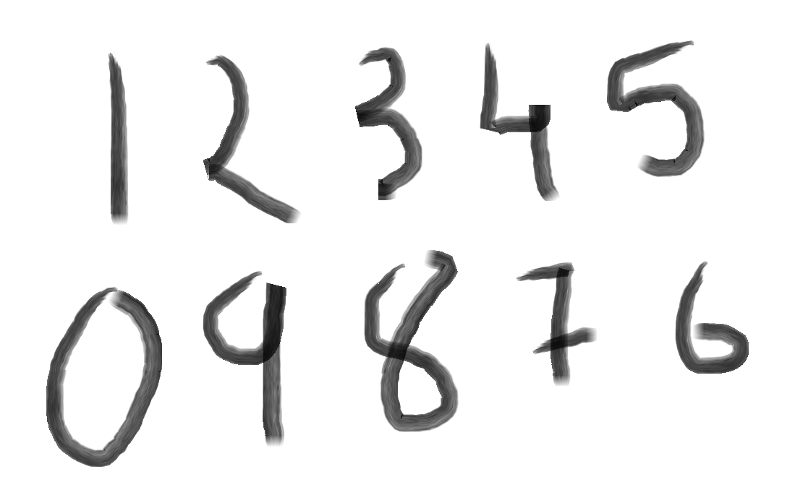

# Handwritten digit Recognition using machine learning

An interactive web application built with Streamlit that recognizes handwritten digits using machine learning. Users can draw a digit (0-9) on a digital canvas, and the pre-trained neural network model instantly predicts which number was drawn.

