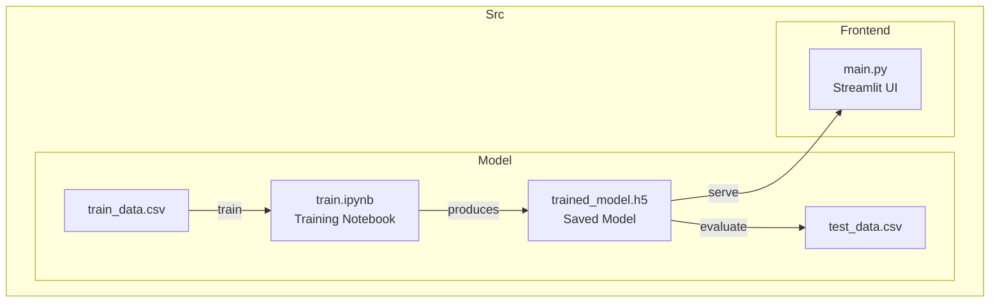

# Digit Recognition using neural networks

Welcome to this brief educational project ! It demonstrates how a convolutional neural network, built with TensorFlow, can recognize handwritten digits.

[](https://www.tensorflow.org/)
[](https://jupyter.org/)
[](https://www.python.org/)
[](https://streamlit.io/)


## This repository will walk you through
- Data preprocessing before feeding it into a machine learning model
- The basics of building a simple convolutional neural network 
- Building a simple web app to try-out the model yourself ! 

This project assumes only a very basic understanding of Python (mainly data handling with Pandas and NumPy) and is inspired by the tensorflow short videos: ML zero to hero (part 1 to 4) which I highly recommend you check out !

[](https://youtu.be/KNAWp2S3w94?feature=shared)

## Project structure

```


├── LICENSE
├── README.md
├── assets
│   └── cover.png
├── src
│    ├── frontend                         #Code for the streamlit frontend
│    │   └── main.py
│    └── model
│        ├── data                         #Data needed to train and test the model
│        │   ├── test_data.csv
│        │   └── train_data.csv
│        ├── train.ipynb                  #Notebook for training the model
│        └── trained_model.h5             #Trained model to perform the predictions
└── environment.yml                       #conda environment dependencies
```

## Project architecture



## Getting started

### Prerequisites
- Python 3.10
- Conda with `conda-forge` channel enabled : 

[](https://www.anaconda.com/download)


### 1) Clone the repo
```
git clone https://github.com/Giulio-grt/Digit-Recognition-using-Neural-networks.git
```


### 2) Create the environment with all prerequisties
```
conda env create -f environment.yml
conda activate digit
```

### 3) Understand how the model was built
Open the training notebook and run the cells:

- File: `src/model/train.ipynb`

> **Note:** You don’t need to install Conda or Python to simply *read* the notebook.  
> GitHub renders Jupyter notebooks directly in the browser, so you can open `src/model/train.ipynb` and scroll through the code and explanations without setting up anything locally.   

### 4) Run the web app
Naviguate to the correct folder :
```
cd Digit-Recognition-using-Neural-networks
```
Open and run the web app:
```
streamlit run src/frontend/main.py
```